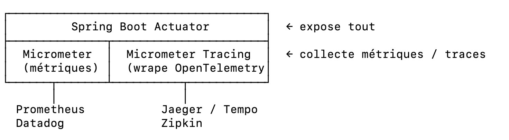

Le cloud native est une approche de conception et de déploiement d'applications 
qui tire pleinement parti des avantages du cloud : scalabilité, résilience, et déploiement rapide.

Les bases du cloud native selon la CNCF sont :

1. Microservices — décomposer l'application en services indépendants, déployables séparément
2. Conteneurs — packager chaque service avec ses dépendances (Docker, etc.)
3. Orchestration dynamique — gérer les conteneurs à grande échelle (Kubernetes)
4. APIs déclaratives — infrastructure et configuration gérées via du code (IaC)

Les microservices permettent notamment :
- Scalabilité indépendante par service
- Déploiements fréquents sans impact global
- Résilience (un service tombe sans impacter les autres)
- Polyglottisme technologique

⏺ Polyglottisme technologique (ou polyglot architecture) = chaque microservice peut être développé 
dans le langage ou la technologie la plus adaptée à son besoin, indépendamment des autres.

Exemples :
- Service de traitement d'images → Python (NumPy, OpenCV)
- Service de paiement → Java
- Service temps réel → Node.js (event-driven, WebSocket)
- Service ML → Python (TensorFlow, PyTorch)

Dans un monolithe, toute l'équipe est contrainte à un seul langage/stack. Avec les microservices, 
chaque équipe choisit ce qui convient le mieux à son domaine.

Les bénéfices clés du cloud native:
- Scalabilité : on scale uniquement le service qui en a besoin
- Résilience : si un service tombe, les autres continuent
- Time-to-market : déploiements fréquents sans risque

**À noter** : cloud native ne nécessite pas forcément des microservices — 
une application peut être cloud native avec une architecture modulaire monolithique (modular monolith), 
mais les microservices en sont la forme la plus répandue. 

---

DevOps est une culture et un ensemble de pratiques qui rapprochent 
les équipes de développement (Dev) et d'opérations (Ops) pour livrer des logiciels plus rapidement et de façon plus fiable.

**culture**:  ce n'est pas un outil, c'est une façon de travailler.

Les pratiques clés :
- CI (Intégration Continue) : Tester automatiquement à chaque commit
- CD (Déploiement Continu) : Déployer automatiquement après les tests 
- Infrastructure as Code
- Monitoring

⏺ CI / CD

`CI — Intégration Continue (Continuous Integration)` :À chaque fois qu'un développeur pousse du code, des vérifications automatiques se lancent.

Ce que ça fait concrètement :
- Compile le code
- Lance les tests automatiques
- Vérifie la qualité du code

`Objectif` : détecter les bugs tôt, avant qu'ils arrivent en prod.

`CD — Déploiement Continu (Continuous Delivery/Deployment)` : Si le CI passe (tous les tests OK), le code est automatiquement déployé.

---
#### Observabilité

`Instrumenter l'observabilité` signifie ajouter du code à une application 
pour qu'elle expose des données permettant de comprendre son comportement interne en production.

Les trois piliers de l'observabilité : 

- Métriques │ Données numériques agrégées dans le temps  │ CPU, mémoire, nombre de messages traités
- Logs      │ Enregistrements textuels d'événements      │ Erreurs, traces d'exécution
- Traces    │ Suivi d'une requête à travers les services │ Latence par étape dans un appel distribué

`Spring Boot Actuator` : Il expose des endpoints HTTP sur ton application. il ne fait qu'exposer. 
Il faut Micrometer pour avoir des métriques riches.

* GET /actuator/health     → { "status": "UP" }         
* GET /actuator/metrics    → liste des métriques disponibles                                                                                      
* GET /actuator/info       → version, build info
  
`Micrometer` — La couche métriques
* C'est le SLF4J des métriques — une façade qui te permet d'écrire du code indépendant du backend.
* Relation avec Actuator : Micrometer alimente /actuator/metrics, Actuator les expose. 

`OpenTelemetry` — Le tracing distribué

* Micrometer = métriques. OpenTelemetry = traces (suivi d'une requête bout en bout).
* Message ActiveMQ → [Span 1: JMS receive] → [Span 2: transform] → [Span 3: publish RabbitMQ]
* Chaque span a : durée, statut, attributs. Ensemble = une trace.

La relation entre les 3:

Actuator expose, Micrometer mesure, OpenTelemetry trace.
---

