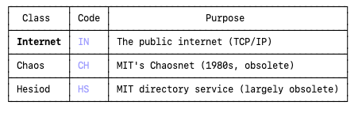

BIND is the open source DNS server used by the majority of DNS servers on the planet.

BIND is distributed by the Internet Systems Consortium, the ISC.

### DNS class
In DNS, every record has three components: name, type, and class.
Class was designed to allow DNS to work across different network types:

When DNS was designed in the early 1980s, the internet wasn't the only network around. The class field was a forward-looking design to support multiple network types under one DNS system.

In practice, Chaosnet and Hesiod died out, and the internet (IN) class won entirely. So today:

- Every A, AAAA, MX, CNAME, etc. record is class IN
- dig defaults to IN automatically
- The field is essentially vestigial — it's always IN

####  Why we need dns class?

Imagine it's 1983. You have two separate networks running in your university:

- Chaosnet — MIT's network, with its own addressing, its own protocol
- ARPANET/TCP/IP — what became the internet

These networks are incompatible. A Chaosnet address and an IP address are completely different things.

Now you want one DNS system to serve both. The problem:

"What is the address of mail.mit.edu?"

The answer depends on which network you're asking for:
- On Chaosnet → give me a Chaosnet address
- On TCP/IP → give me an IP address

Without a class field, DNS can't distinguish. So the class was the way to say:

`TCP/IP client asking:`

mail.mit.edu  IN  A  18.72.0.3       ← internet address

`Chaosnet client asking:`

mail.mit.edu  CH  A  MIT-AJAX        ← chaosnet address

Same name, same record type (A), but different class = different answer.

The class let a single DNS server hold records for multiple network types and return the right answer depending on who was asking.

Since Chaosnet died and TCP/IP won, you always ask IN, always get an IP address, and the class field became pointless — but the slot in the record format remains.                         
                  

### DNS useful commands

* `dnswalk`
* `dnsrecon`

---

#### What is a zone file for example.com?

    the zone file lives on the authoritative server, because that server is the only one who officially owns the records for that domain.

A zone file is just a text configuration file that tells the DNS server:

`"For the domain example.com, here are all the answers to give when someone asks about it"
`

It lives on the DNS server that is responsible for example.com.

The Authoritative Server is special because:

     - It is the final and definitive answer
     - It holds the zone file for example.com
     - No one can override its answer
     - All other servers above it just redirect to it

In a DNS zone file, `@` is a shorthand for the zone's own domain name (the origin).

### Reading a zone file

The zone is defined at the top of the zone file, using the $ORIGIN directive or the SOA record:

Option 1:

    $ORIGIN example.com.                                                                             
    wwww   IN  A   192.168.1.1

Option 2: 

    example.com.   IN  SOA   ns1.example.com. admin.example.com. (
                                2024010101  ; serial                                                                                
                                3600        ; refresh                                                                            
                                900         ; retry                                                                             
                                604800      ; expire                                                                              
                                300 )       ; TTL                                                                             
    wwww   IN  A   192.168.1.1
    
    The first name in the SOA record (example.com.) is the zone name.

Option 3 — DNS server config (e.g. BIND named.conf):

    zone "example.com" {
          type master;
          file "/etc/bind/db.example.com";
    };
The zone name is declared here, and the zone file itself doesn't need $ORIGIN.

### Rule of thumb:
     
    A relative name like wwww (no trailing dot) is always relative to the current $ORIGIN. A fully qualified name has a trailing dot: wwww.example.com.

---

Every line follows this structure:  `WHO   CLASS   TYPE   VALUE`

* WHO: Which domain are we talking about?
* CLASS: Always IN (means "Internet")
* TYPE: What kind of question is being answered?
* VALUE: The answer

Example: 

`@    IN  A     192.168.1.1` => "If someone asks what is the IP address of example.com? **Answer**: 192.168.1.1"

`@    IN  MX    mail.example.com.` => "If someone asks where should I send emails for example.com? **Answer**: send them to the server mail.example.com"

`@    IN  NS    ns1.example.com.` => "If someone asks which DNS server is responsible for example.com? **Answer**: ns1.example.com"

`wwww   IN  A     192.168.1.1` => wwww.example.com resolves to 192.168.1.1

#### SOA = Start of Authority

It is the first and most important record in any zone file.                                                                                                                                                         
It says: "I am the official record that describes this zone"

## ⏺ The Trailing Dot Rule

In DNS zone files, a dot at the end means "this is the complete, full name — don't add anything to it." 

Without trailing dot → relative (incomplete)    

**Example**: 

`wwww ` : DNS reads this as:  **wwww**, plus whatever the current `$ORIGIN` is. If  `$ORIGIN"` is example.com. → becomes wwww.example.com. 

The trailing dot stops DNS from appending $ORIGIN to the name.

`other.org.  IN  A  192.168.1.3       ; → other.org.  (unchanged, already absolute)
`
---

## PTR Records (Pointer Records) in DNS

---
What are they?

PTR records enable reverse DNS lookups — mapping an IP address back to a hostname. They are the inverse of A/AAAA records: 

* A   :  hostname → IP   :  mail.example.com → 192.0.2.10
* PTR :  IP → hostname   :  192.0.2.10 → mail.example.com

---
How they work?

Special zone: `in-addr.arpa`

PTR records live in a special DNS zone. The IP address is reversed and appended with .in-addr.arpa:  

    IP:       192.0.2.10
    Reversed: 10.2.0.192                                  
    PTR name: 10.2.0.192.in-addr.arpa.  →  mail.example.com.

    For IPv6, the zone is ip6.arpa, with each nibble reversed:
    IP:       2001:db8::1
    PTR name: 1.0.0.0...8.b.d.0.1.0.0.2.ip6.arpa.  →  mail.example.com. 

---
Who owns the zone?

The in-addr.arpa zone for a block is delegated by the IP owner (your ISP or cloud provider), not by the domain registrar. This means:
- You cannot self-manage PTR records unless your provider delegates the reverse zone to you
- On GCP, AWS, Azure — you configure PTR records through the cloud console or API, not through your domain registrar

---
When to use them ?
