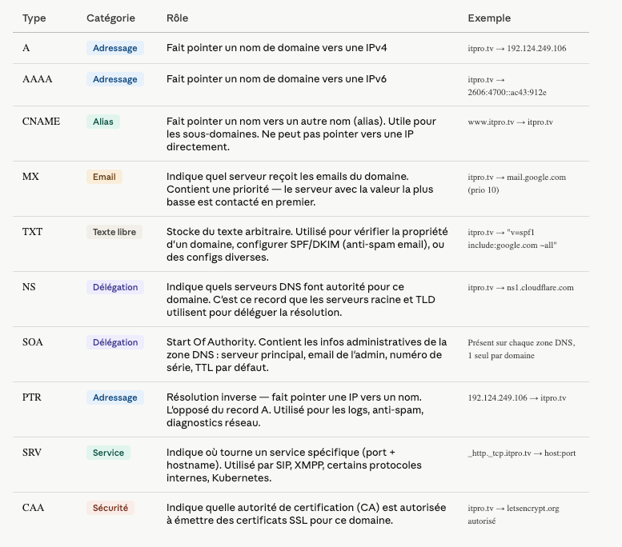
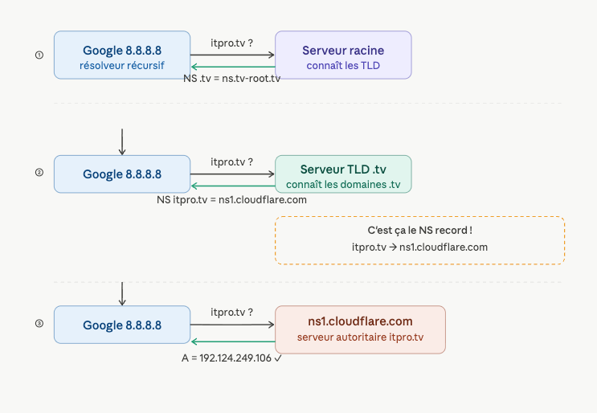
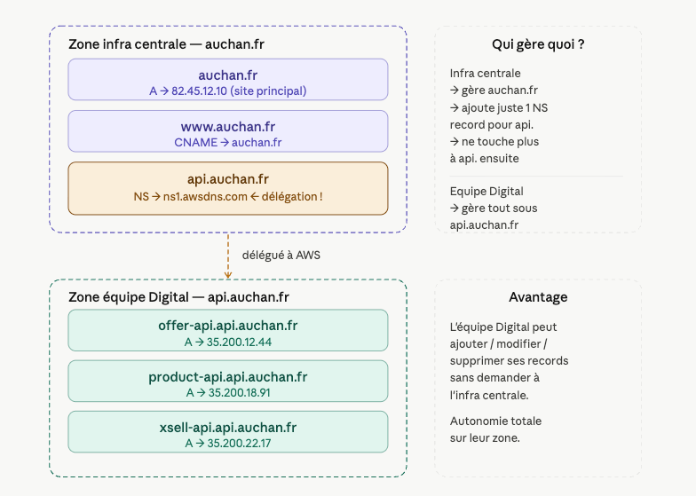

Il existe une dizaine de types de records DNS courants, chacun avec un rôle précis.

--- 

#### Où sont stockés ces records ?

Ils sont stockés sur le serveur DNS autoritaire du domaine — c'est-à-dire le serveur indiqué dans les records NS. En pratique c'est l'interface de ton hébergeur DNS : Cloudflare, OVH, AWS Route 53, Google Cloud DNS... Tu les édites via une interface web ou une API, et le serveur autoritaire les sert à tous ceux qui les demandent.

---

#### NS record

Le NS c'est le record qui répond à la question : "à qui je dois poser mes questions pour ce domaine ?"

le NS c'est un record qui indique quel serveur contient l'IP finale

pour avoir les vraies réponses sur itpro.tv, va parler à ns1.cloudflare.com". C'est Cloudflare (ou OVH, ou Route 53...) qui détient alors tous les autres records : A, MX, TXT, etc.

---

#### Délégation de zone

Imagine une grande entreprise avec un standard téléphonique
auchan (le groupe entier) a un standard central. Quand quelqu'un appelle, le standard sait vers quel service rediriger. C'est l'équipe infra centrale qui gère ce standard — ils décident qui répond à quoi.
Maintenant l'équipe Digital (toi) veut gérer ses propres numéros pour ses APIs, sans dépendre du standard central à chaque fois. Elle dit à la direction : "laissez-nous gérer les appels qui commencent par api.".
La direction (infra centrale) accepte et met un panneau dans le standard : "tout ce qui concerne api.google.fr → appelez directement le standard de l'équipe Digital".
C'est ça la délégation de zone.

**Ce qui se passe concrètement quand quelqu'un résout offer-api.api.auchan.fr**
① Google demande au serveur racine → redirigé vers le TLD .fr
② Le TLD .fr répond : "pour auchan.fr → va voir l'infra centrale"
③ L'infra centrale répond : "pour api.auchan.fr → je ne gère pas, va voir ns1.awsdns.com" — c'est le NS record de délégation
④ AWS Route 53 (ns1.awsdns.com) répond : "offer-api.api.auchan.fr = 35.200.12.44" — réponse finale