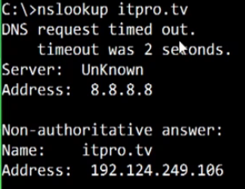
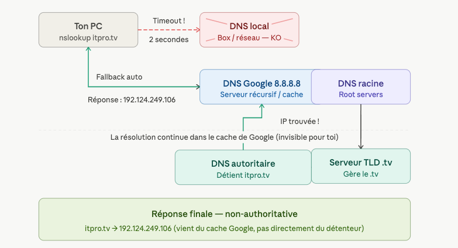

nslookup (Name Server Lookup):  Command line utility that talks to DNS servers, 
so that we can recreate the queries that all of our other servers are doing in the background.

if I wanna find out what the IP address of the ITProTV website => `nslookup itpro.tv`



2. Pourquoi "DNS request timed out" ?
   Quand ton PC tape nslookup itpro.tv, il commence par demander à son DNS local — c'est souvent la box internet ou un serveur configuré par ton réseau. Là, ce serveur n'a pas répondu en 2 secondes → timeout. Soit il était down, soit un firewall bloquait le port 53 (le port utilisé par DNS).

3. Pourquoi 8.8.8.8 comme fallback ?
   Windows a une liste de DNS de secours. Si le premier ne répond pas, il essaie le suivant. Ici il est tombé sur 8.8.8.8, le DNS public de Google. C'est un serveur ultra-disponible, gratuit, connu dans le monde entier.

4. Le vrai flux de résolution (les coulisses)

     Quand Google reçoit ta question sur itpro.tv, il fait lui-même plusieurs étapes en cascade :
     * Il demande aux `serveurs racine` (les 13 grands serveurs mondiaux qui savent "qui gère le .tv")
     * il contacte le cache en premier, les `serveurs racine` c'est seulement quand le cache est vide.
     * Ces serveurs racine répondent : "va voir le serveur TLD .tv"
     * Le serveur TLD dit : "va voir le serveur autoritaire de itpro.tv"
     * Le serveur autoritaire répond : l'IP c'est 192.124.249.106

     Google garde ensuite cette réponse en cache pour les prochaines fois.

5. "Non-authoritative answer", c'est quoi ?
   Il y a deux types de réponses DNS :

`Autoritaire` : la réponse vient directement du serveur qui "possède" le domaine (celui chez lequel itpro.tv est hébergé). C'est la source de vérité.
`Non-autoritaire` : la réponse vient d'un serveur intermédiaire (ici Google) qui l'a récupérée quelque part et l'a mise en cache. C'est toujours fiable dans 99% des cas.



---

qui configure DNS local et il est configuré ou ?

`Chez toi (réseau perso)`
C'est ta box qui joue le rôle de DNS local. Elle est configurée automatiquement par ton FAI (Orange, SFR, Free...) via un protocole qui s'appelle DHCP.
Le flux est le suivant : quand ton PC se connecte au réseau, ta box lui dit automatiquement "pour résoudre les noms DNS, envoie tes requêtes à moi — mon IP c'est 192.168.1.1" (ou 192.168.0.1 selon les box). Ton PC enregistre ça et ne pose plus de question. Tu n'as rien configuré toi-même.
Ta box elle-même fait suivre les requêtes vers les DNS de ton FAI (ex: 80.10.246.2 pour Orange), ou vers des DNS publics si tu l'as modifié manuellement.


`En entreprise`
C'est beaucoup plus structuré. Il y a des serveurs DNS internes gérés par l'équipe infra/réseau. Ils servent à deux choses : résoudre les domaines internes (itpro-api.internal, grafana.itpro.local...) et faire suivre les requêtes publiques vers l'extérieur.
La configuration est poussée sur les machines via DHCP d'entreprise ou directement dans les images des VMs/pods. Sur GKE par exemple, chaque pod reçoit automatiquement l'adresse du DNS interne du cluster (kube-dns / CoreDNS) via la configuration du kubelet — tu n'as rien à toucher à la main.

Sur tes pods GKE, si tu fais kubectl exec <pod> -- cat /etc/resolv.conf tu verras quelque chose comme nameserver 10.96.0.10 — c'est l'IP de CoreDNS dans le cluster, injectée automatiquement par Kubernetes. C'est lui le "DNS local" de tes microservices.

---

#### points clés à retenir

**1. Vérifier la propagation DNS :**
Quand tu changes un enregistrement DNS, il ne se propage pas instantanément partout. Pour vérifier où le changement est arrivé, tu fais des `nslookup` contre plusieurs serveurs différents — Google (`8.8.8.8`), Level3 (`4.2.2.1`), ton FAI, etc. En pratique aujourd'hui, la propagation prend rarement plus d'une heure.

**2. Overrider le DNS dans nslookup :**
Par défaut, `nslookup` utilise le DNS configuré sur ta machine (carte réseau sur Windows, `/etc/resolv.conf` sur Mac/Linux). Tu peux lui dire d'utiliser un autre serveur en le spécifiant directement dans la commande :
```
nslookup itpro.tv 8.8.8.8
```
Ça interroge Google au lieu de ton DNS habituel.

**3. Le cache DNS de l'OS — point important :**
Windows (et d'autres OS) ont un **cache DNS local** — quand tu visites un site, la réponse DNS est stockée en mémoire. Les requêtes suivantes n'interrogent plus le serveur DNS, elles lisent le cache directement. C'est ce cache qui est responsable du fameux "délai de 40h" dont les gens parlent quand ils changent de DNS.

Pour vider ce cache sur Windows :
```
ipconfig /flushdns
```

**4. Piège classique : nslookup ≠ navigateur**
`nslookup` **bypass** le cache DNS de Windows. Ton navigateur lui **l'utilise**. Résultat : tu peux avoir une situation où `nslookup` te retourne la bonne IP, mais ton navigateur ne charge pas le site parce qu'il lit une vieille entrée en cache. Si ça arrive → `ipconfig /flushdns` puis réessaie.


>nslookup interroge directement les serveurs DNS en sautant le cache OS, ce que les navigateurs ne font pas — d'où des comportements différents entre les deux.


---
**Level 3** (maintenant appelé **Lumen Technologies**) c'est un des plus grands opérateurs de réseau Internet au monde. C'est ce qu'on appelle un **Tier 1 ISP** — ils possèdent physiquement des câbles sous-marins, des fibres intercontinentales, des datacenters partout dans le monde.

En plus de leur infrastructure réseau, ils exposent des **DNS publics gratuits** :

```
4.2.2.1
4.2.2.2
4.2.2.3
```

Ces IPs sont célèbres dans le monde réseau/sysadmin — elles existaient bien avant que Google sorte `8.8.8.8` en 2009.


**Pourquoi les utiliser pour tester la propagation ?**

Parce que Level 3 est un acteur **indépendant de ton FAI et de Google**. Si tu testes ton changement DNS contre `8.8.8.8` (Google) ET `4.2.2.1` (Level 3) ET le DNS de ton FAI, et que les trois retournent la même IP → ton changement a bien propagé sur des infrastructures très différentes. C'est une bonne validation.

C'est juste un autre point de mesure indépendant, ni meilleur ni moins bon que `8.8.8.8`, utilisé précisément parce qu'il est **différent**

---

`A record → IPv4`

Retourne une adresse sur 32 bits, le format qu'on connait tous :
itpro.tv  →  192.124.249.106

`AAAA record → IPv6`

Retourne une adresse sur 128 bits, le "nouveau" format :
itpro.tv  →  2606:4700:3037::ac43:912e

`Pourquoi IPv6 existe ?`

**IPv4 c'est 32 bits → 4 milliards d'adresses maximum**. En 2011, le stock mondial d'IPv4 était officiellement épuisé. Il y a trop d'appareils connectés dans le monde.
IPv6 c'est 128 bits → 340 undécillions d'adresses (un nombre tellement grand qu'on pourrait donner une IP unique à chaque grain de sable sur Terre plusieurs fois).


